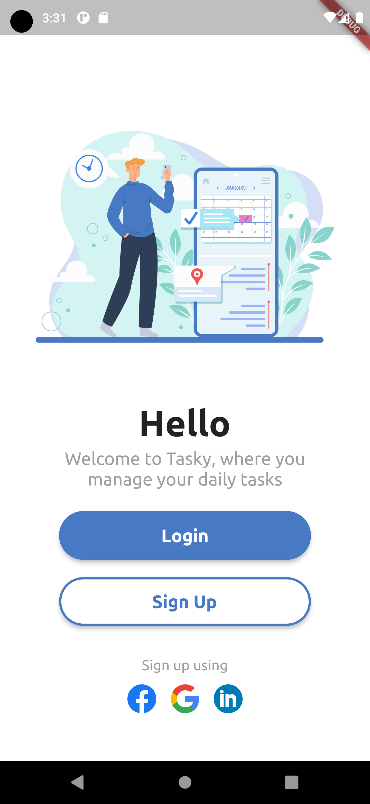

<<<<<<< HEAD

# LibGuide App Development - 30-Day Progress

## Overview
In the next 30 days, I'll be building a comprehensive Flutter library guide app for Flutter Development . This log will document my daily progress, challenges, and key learnings. Additionally, I'll be relearning all Flutter essentials to ensure a solid foundation for the project.

## Day 1: Getting Started with Flutter

### Tasks
- UI for Login page 

### Resources
- [Flutter UI Login Page](https://dribbble.com/shots/22553132-Mobile-Login-Page)

## Day 2: Understanding Widgets in Flutter

### Tasks
- 

### Resources
- [Flutter Widgets Overview](https://flutter.dev/docs/development/ui/widgets)
- [Stateless and Stateful Widgets](https://flutter.dev/docs/development/ui/interactive#state)
- [Flutter Widget Catalog](https://flutter.dev/docs/development/ui/widgets)

## Day 3: [Your Topic]

### Tasks
- [Task 1]
- [Task 2]
- [Task 3]

### Resources
- [Related Resource 1]
- [Related Resource 2]
- [Related Resource 3]

...
=======
# login_app

SignUp and Login using this app with its simple and stunning UI

## Output

### What i used

packages: Material, Firebase auth, Loading overlay, rFlutter alert

assets: images represeting the heading for each app page and one font to style the text
>>>>>>> a84a877 (first commit)
